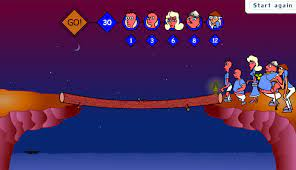
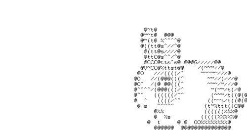

# Proyecto POO : **La Barca**


## Integrantes

> - Carlos Andrés Hernández Agudelo
> - Jose Luis Hincapie Bucheli
> - Sebastian Quintero Ramírez
> - Jose Antonio Fernandez
> - Susana Valencia Bravo

## Clases con sus relaciones y posibles metodos



### Clase Jugador

```cpp
/*
Archivo: Jugador.h
Autores:
Carlos Andrés Hernández Agudelo
=>carlos.hernandez.agudelo@correounivalle.edu.co
Jose Luis Hincapie Bucheli
=>jose.bucheli@correounivalle.edu.co
Sebastian Quintero Ramírez
=> sebastian.quintero.ramirez@correounivalle.edu.co
Jose Antonio Fernandez
=> jose.antonio.fernandez@correounivalle.edu.co
Susana Valencia Bravo
=>susana.valencia@correounivalle.edu.co
Fecha creacion: No aplica
Fecha ultima modificacion: No aplica
licencia: GNU-GPL
*/

/**
Clase: Jugador.h
Responsabilidad: Servir como el centro del juego, es decir, mediante esta clase se leeran las teclas, se les dara ordenes a los individuos, se mostraran los resultados y demás
Relaciones:
Contiene Lugar (Barca, Izquierda, Derecha)
Contiene Personajes (Robo, Lechuga, Conejo, Lobo)
*/

#ifndef _JUGADOR_H_
#define _JUGADOR_H_

#include <iostream>
using namespace std;

class Jugador
{
  // Atributos
private:
  // Meotodos
public:
  // Constructor
  Jugador();
  // Destructor
  ~Jugador();
  // Funciones
};

#endif
```

### Clase Lugar

```cpp
/*
Archivo: Lugar.h
Autores:
Carlos Andrés Hernández Agudelo
=>carlos.hernandez.agudelo@correounivalle.edu.co
Jose Luis Hincapie Bucheli
=>jose.bucheli@correounivalle.edu.co
Sebastian Quintero Ramírez
=> sebastian.quintero.ramirez@correounivalle.edu.co
Jose Antonio Fernandez
=> jose.antonio.fernandez@correounivalle.edu.co
Susana Valencia Bravo
=>susana.valencia@correounivalle.edu.co
Fecha creacion: No aplica
Fecha ultima modificacion: No aplica
licencia: GNU-GPL
*/

/**
Clase: Lugar.h
Responsabilidad: En esta clase se almacenara los personajes que esten en tres posiciones, la izquierda, el centro (rio), y la derecha.
Relaciones:
Conoce a Personajes (Lobo, Conejo, Lechuga, Robot)
Conoce Jugador
*/

#ifndef _LUGAR_H_
#define _LUGAR_H_

#include <iostream>
using namespace std;

class Lugar
{
  // Atributos
private:
  // Meotodos
public:
  // Constructor
  Lugar();
  // Destructor
  ~Lugar();
  // Funciones
};

#endif
```


### Clase Izquierda

```cpp
/*
Archivo: Izquierda.h
Autores:
Carlos Andrés Hernández Agudelo
=>carlos.hernandez.agudelo@correounivalle.edu.co
Jose Luis Hincapie Bucheli
=>jose.bucheli@correounivalle.edu.co
Sebastian Quintero Ramírez
=> sebastian.quintero.ramirez@correounivalle.edu.co
Jose Antonio Fernandez
=> jose.antonio.fernandez@correounivalle.edu.co
Susana Valencia Bravo
=>susana.valencia@correounivalle.edu.co
Fecha creacion: No aplica
Fecha ultima modificacion: No aplica
licencia: GNU-GPL
*/

/**
Clase: Izquierda.h
Responsabilidad: Esta clase se encargara de contener todos los personajes en la parte izquierda, definiendo el lugar y lo que puede pasar aquí
Relaciones:
Es Lugar
Conoce a Personaje (Lobo, Lechuga, Conejo, Robot)
*/

#ifndef _IZQUIERDA_H_
#define _IZQUIERDA_H_

#include <iostream>
using namespace std;

class Izquierda
{
  // Atributos
private:
  // Meotodos
public:
  // Constructor
  Izquierda();
  // Destructor
  ~Izquierda();
  // Funciones
};

#endif
```

### Clase Derecha

```cpp
/*
Archivo: Derecha.h
Autores:
Carlos Andrés Hernández Agudelo
=>carlos.hernandez.agudelo@correounivalle.edu.co
Jose Luis Hincapie Bucheli
=>jose.bucheli@correounivalle.edu.co
Sebastian Quintero Ramírez
=> sebastian.quintero.ramirez@correounivalle.edu.co
Jose Antonio Fernandez
=> jose.antonio.fernandez@correounivalle.edu.co
Susana Valencia Bravo
=>susana.valencia@correounivalle.edu.co
Fecha creacion: No aplica
Fecha ultima modificacion: No aplica
licencia: GNU-GPL
*/

/**
Clase: Derecha.h
Responsabilidad: Esta clase se encargara de contener todos los personajes en la parte derecha, definiendo el lugar y lo que puede pasar aquí
Relaciones:
Es Lugar
Conoce a Personajes (Lobo, Lechuga, Conejo, Robot)
*/

#ifndef _DERECHA_H_
#define _DERECHA_H_

#include <iostream>
using namespace std;

class Derecha
{
  // Atributos
private:
  // Meotodos
public:
  // Constructor
  Derecha();
  // Destructor
  ~Derecha();
  // Funciones
};

#endif
```


### Clase Barca

```cpp
/*
Archivo: Barca.h
Autores:
Carlos Andrés Hernández Agudelo
=>carlos.hernandez.agudelo@correounivalle.edu.co
Jose Luis Hincapie Bucheli
=>jose.bucheli@correounivalle.edu.co
Sebastian Quintero Ramírez
=> sebastian.quintero.ramirez@correounivalle.edu.co
Jose Antonio Fernandez
=> jose.antonio.fernandez@correounivalle.edu.co
Susana Valencia Bravo
=>susana.valencia@correounivalle.edu.co
Fecha creacion: No aplica
Fecha ultima modificacion: No aplica
licencia: GNU-GPL
*/

/**
Clase: Barca.h
Responsabilidad: Esta clase manejara la barca, la cual puede solo llevar un numero especifico de personajes, y sirve para transportar a estos de un lugar a otro
Relaciones:
Es Lugar
Conoce a Personaje (Lobo, Lechuga, Conejo, Robot)
*/

#ifndef _BARCA_H_
#define _BARCA_H_

#include <iostream>
using namespace std;

class Barca
{
  // Atributos
private:
  // Meotodos
public:
  // Constructor
  Barca();
  // Destructor
  ~Barca();
  // Funciones
};

#endif
```


### Clase Personajes

```cpp
/*
Archivo: Personaje.h
Autores:
Carlos Andrés Hernández Agudelo
=>carlos.hernandez.agudelo@correounivalle.edu.co
Jose Luis Hincapie Bucheli
=>jose.bucheli@correounivalle.edu.co
Sebastian Quintero Ramírez
=> sebastian.quintero.ramirez@correounivalle.edu.co
Jose Antonio Fernandez
=> jose.antonio.fernandez@correounivalle.edu.co
Susana Valencia Bravo
=>susana.valencia@correounivalle.edu.co
Fecha creacion: No aplica
Fecha ultima modificacion: No aplica
licencia: GNU-GPL
*/

/**
Clase: Personaje.h
Responsabilidad: Esta sera la clase padre que servira como modelo para las clases hijas (Clase Lobo, Conejo, Lechuga, Robot)
Relaciones:
Conoce a Lugares (Izquierda, Derecha, Barca)
*/

#ifndef _PERSONAJE_H_
#define _PERSONAJE_H_

#include <iostream>
using namespace std;

class Personaje
{
  // Atributos
private:
  // Meotodos
public:
  // Constructor
  Personaje();
  // Destructor
  ~Personaje();
  // Funciones
};

#endif
```

### Clase Lobo

```cpp
/*
Archivo: Lobo.h
Autores:
Carlos Andrés Hernández Agudelo
=>carlos.hernandez.agudelo@correounivalle.edu.co
Jose Luis Hincapie Bucheli
=>jose.bucheli@correounivalle.edu.co
Sebastian Quintero Ramírez
=> sebastian.quintero.ramirez@correounivalle.edu.co
Jose Antonio Fernandez
=> jose.antonio.fernandez@correounivalle.edu.co
Susana Valencia Bravo
=>susana.valencia@correounivalle.edu.co
Fecha creacion: No aplica
Fecha ultima modificacion: No aplica
licencia: GNU-GPL
*/

/**
Clase: Lobo.h
Responsabilidad: Esta clase definira aquellos metodos y atributos especificos para la clase Lobo
Relaciones:
Es Personaje
Conoce a Lugares (Izquierda, Derecha, Barca)
*/

#ifndef _LOBO_H_
#define _LOBO_H_

#include <iostream>
using namespace std;

class Lobo
{
  // Atributos
private:
  // Meotodos
public:
  // Constructor
  Lobo();
  // Destructor
  ~Lobo();
  // Funciones
};

#endif
```



### Clase Conejo

```cpp
/*
Archivo: Conejo.h
Autores:
Carlos Andrés Hernández Agudelo
=>carlos.hernandez.agudelo@correounivalle.edu.co
Jose Luis Hincapie Bucheli
=>jose.bucheli@correounivalle.edu.co
Sebastian Quintero Ramírez
=> sebastian.quintero.ramirez@correounivalle.edu.co
Jose Antonio Fernandez
=> jose.antonio.fernandez@correounivalle.edu.co
Susana Valencia Bravo
=>susana.valencia@correounivalle.edu.co
Fecha creacion: No aplica
Fecha ultima modificacion: No aplica
licencia: GNU-GPL
*/

/**
Clase: Conejo.h
Responsabilidad: Esta clase definira aquellos metodos y atributos especificos para la clase Conejo
Relaciones:
Es Personaje
Conoce a Lugares (Izquierda, Derecha, Barca)

*/

#ifndef _CONEJO_H_
#define _CONEJO_H_

#include <iostream>
using namespace std;

class Conejo
{
  // Atributos
private:
  // Meotodos
public:
  // Constructor
  Conejo();
  // Destructor
  ~Conejo();
  // Funciones
};

#endif
```

### Clase Lechuga

```cpp
/*
Archivo: Lechuga.h
Autores:
Carlos Andrés Hernández Agudelo
=>carlos.hernandez.agudelo@correounivalle.edu.co
Jose Luis Hincapie Bucheli
=>jose.bucheli@correounivalle.edu.co
Sebastian Quintero Ramírez
=> sebastian.quintero.ramirez@correounivalle.edu.co
Jose Antonio Fernandez
=> jose.antonio.fernandez@correounivalle.edu.co
Susana Valencia Bravo
=>susana.valencia@correounivalle.edu.co
Fecha creacion: No aplica
Fecha ultima modificacion: No aplica
licencia: GNU-GPL
*/

/**
Clase: Lechuga.h
Responsabilidad: Esta clase definira aquellos metodos y atributos especificos para la clase Lechuga. (A pesar de que en la vida real no es un personaje, para el juego y por efectos practicos se trabajara como clase hija de Personaje)
Relaciones:
Es Personaje
Conoce a Lugares (Izquierda, Derecha, Barca)

*/

#ifndef _LECHUGA_H_
#define _LECHUGA_H_

#include <iostream>
using namespace std;

class Lechuga
{
  // Atributos
private:
  // Meotodos
public:
  // Constructor
  Lechuga();
  // Destructor
  ~Lechuga();
  // Funciones
};

#endif
```

### Clase Robot

```cpp
/*
Archivo: Robot.h
Autores:
Carlos Andrés Hernández Agudelo
=>carlos.hernandez.agudelo@correounivalle.edu.co
Jose Luis Hincapie Bucheli
=>jose.bucheli@correounivalle.edu.co
Sebastian Quintero Ramírez
=> sebastian.quintero.ramirez@correounivalle.edu.co
Jose Antonio Fernandez
=> jose.antonio.fernandez@correounivalle.edu.co
Susana Valencia Bravo
=>susana.valencia@correounivalle.edu.co
Fecha creacion: No aplica
Fecha ultima modificacion: No aplica
licencia: GNU-GPL
*/

/**
Clase: Robot.h
Responsabilidad: Esta clase definira aquellos metodos y atributos especificos para la clase Robot
Relaciones:
Es Personaje
Conoce a Lugares (Izquierda, Derecha, Barca)
*/

#ifndef _ROBOT_H_
#define _ROBOT_H_

#include <iostream>
using namespace std;

class Robot
{
  // Atributos
private:
  // Meotodos
public:
  // Constructor
  Robot();
  // Destructor
  ~Robot();
  // Funciones
};

#endif
```


### Clase Game

```cpp
/*
Archivo: Game.h
Autores:
Carlos Andrés Hernández Agudelo
=>carlos.hernandez.agudelo@correounivalle.edu.co
Jose Luis Hincapie Bucheli
=>jose.bucheli@correounivalle.edu.co
Sebastian Quintero Ramírez
=> sebastian.quintero.ramirez@correounivalle.edu.co
Jose Antonio Fernandez
=> jose.antonio.fernandez@correounivalle.edu.co
Susana Valencia Bravo
=>susana.valencia@correounivalle.edu.co
Fecha creacion: No aplica
Fecha ultima modificacion: No aplica
licencia: GNU-GPL
*/

/**
Clase: Game.h
Responsabilidad: Esta clase se encargará de casí todas la funciones iniciales de la interfaz graficas (en este claso SDL2)
Relaciones:
Contiene a Player
*/

#ifndef _GAME_H_
#define _GAME_H_

#include <iostream>
using namespace std;

class Game
{
  // Atributos
private:
  // Meotodos
public:
  // Constructor
  Game();
  // Destructor
  ~Game();
  // Funciones
};

#endif
```
