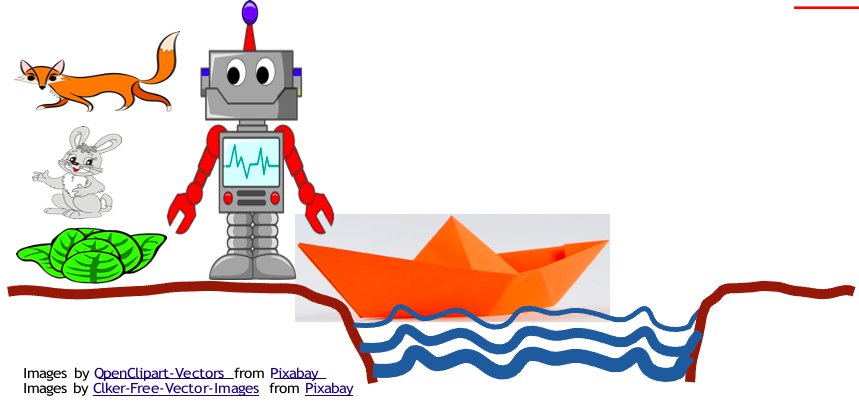

# Proyecto Juego de la Barca

## Descripcion

> Hay un robot que debe transportar un zorro, un conejo y una lechuga desde un lado del río hasta la otra orilla, usando una barca. En la barca solo cabe uno de los tres individuos, además del robot. El problema es que si el robot deja solos al zorro y al conejo, el zorro se comerá el conejo. Y si deja solos al conejo y la lechuga, el conejo se comerá la lechuga. El jugador debe controlar qué órdenes dar, para lograr que el robot transporte los tres individuos a la otra orilla, sanos y salvos.

---
## Integrantes

- Carlos Andrés Hernández Agudelo | [Perfil de GitHub](https://github.com/Carlosher007)
  - carlos.hernandez.agudelo@correounivalle.edu.co
- Jose Luis Hincapie Bucheli | [Perfil de GitHub](https://github.com/TheCryss)
  - jose.bucheli@correounivalle.edu.co
- Sebastian Quintero Ramírez
  - sebastian.quintero.ramirez@correounivalle.edu.co
- Jose Antonio Fernandez
  - jose.antonio.fernandez@correounivalle.edu.co
- Susana Valencia Bravo
  - susana.valencia@correounivalle.edu.co

---

## Tecnologias Utilizadas

| Tecnologia       |                Descripcion                |
| :--------------: | :---------------------------------------: |
|  C++  | Es un lenguaje de programación que proviene de la extensión del lenguaje C para que pudiese manipular objetos, que provee ventajas como alto rendimiento o multiplataforma  |
|  SDL 2  | Es un conjunto de bibliotecas desarrolladas en el lenguaje de programación C que proporcionan funciones básicas para realizar operaciones de dibujo en dos dimensiones, gestión de efectos de sonido y música, además de carga y gestión de imágenes|
| Visual Studio Community Edition | Descrito como el mejor IDE completo para desarrolladores de .NET y C++ en Windows. Completamente equipado con una buena matriz de herramientas y características para elevar y mejorar todas las etapas del desarrollo de software|
